# When Is Global EOF Reduction Insufficient in Multi-Fidelity Flood Inundation Emulation?

**Working title (methods paper).** Hydrodynamically zoned LSG-Max under equal mode budget, area-weighted metrics, and train-only zoning.

**Status:** English manuscript draft v0.7 (Track B evidence locked). Code and evaluation artefacts: https://github.com/Coucou2016/202606-JOH-zonal-LSG.

**One-sentence argument:** Spatial zoning is not universally advantageous, but a global EOF representation can be performance-sensitive under constrained retained-mode capacity; under a matched retained-mode-budget protocol, zoning value is conditional on how spatial structure enters the coupled reduced-representation and LF-to-HF mapping pipeline, and first-order EOI alone cannot decide when to zone.

---

## Abstract

High-resolution two-dimensional flood models remain computationally expensive for ensemble and real-time applications. Multi-fidelity LSG surrogates map coarse hydrodynamic fields to high-fidelity inundation fields through EOF reduction and Gaussian-process coefficient mapping, typically using a single global EOF domain. We test whether zoning changes LSG-Max depth skill when total retained-mode capacity is matched on the public Fraehr benchmark. At Carlisle (B = 4), rule zoning reduced area-weighted RMSE from 0.1464 to 0.0964 m and improved all nine leave-one-out folds; the official two-fold sensitivity analysis was non-significant. Burnett 30-fold leave-one-out did not favour zoning, while at Chowilla LSG performed worse than the low-fidelity field alone. Max-surface EOI values of 0.057, 0.116, and 0.957 for Carlisle, Chowilla, and Burnett, respectively, did not rank the observed zoning benefit. Pure-EOF oracles, together with a Carlisle stage-swap, argue against a truncation-only explanation and are consistent with a coupled representation–mapping effect. Zoning is therefore a conditional representation choice, not a universal prescription.

**Keywords:** multi-fidelity surrogate; flood inundation; EOF; Gaussian Process; LSG; zonal reduction; equal-budget comparison

---

## 1. Introduction

Fine-grid two-dimensional hydrodynamic models remain the reference for flood extent and depth, yet their cost still limits large ensembles, scenario design, and operational refresh cycles (Teng et al., 2017; Bates, 2022). Multi-fidelity strategies retain a physically based low-fidelity (LF) run and learn a correction toward high-fidelity (HF) fields from a modest training set. The LSG family implements this idea by projecting LF and HF inundation onto EOF spatial modes and training Gaussian Process (GP) models on expansion coefficients (Fraehr et al., 2022, 2023, 2024). Related work spans deep-learning inundation surrogates and hybrid LF–GP pipelines (Bentivoglio et al., 2022; Lu et al., 2025). Baseline LSG implementations have predominantly used a single EOF domain, although recent studies have begun to regionalize training or spatial representation.

That global basis is convenient, but it is not necessarily performance-neutral for depth emulation. Channel, frequently inundated shelves, and fringe shallow water can mix into shared leading modes. When the retained-mode budget B is tight, such mixing may allocate limited capacity inefficiently and alter downstream depth learning even when wet–dry skill looks acceptable. Prior work already shows that spatial reduction, rotated or localized EOF structure, and LSG regionalization can help in focused settings: PCA–ANN downscaling (Carreau and Guinot, 2021), SRR/USRR reconstruction (Zhou et al., 2021, 2022), REOF–sparse-GP flood surrogates that motivate localized EOF structure inside an LF–EOF–GP pipeline (Wang et al., 2025), and regionalized LSG training for local velocity dimensionality-reduction error (Tan et al., 2025). Those precedents rule out any claim that regionalizing EOF or LSG is itself novel. Against this background, the unresolved question is not whether LSG can be regionalized, but whether zoning changes LSG-Max depth skill when total retained-mode capacity is matched, whether any gain can be localized within the representation–mapping pipeline, and where that benefit fails to generalize.

Operationally, the representation choice matters because retained-mode budgets are rarely unconstrained: storage, training cost, and the desire for compact surrogates push practitioners toward small B. If a global basis mixes deep-channel and shallow-fringe variance into the same leading modes, equal-capacity zoning can change how limited modes are spent even when the hydrodynamic LF already captures wetting extent well. The present study therefore isolates representation under matched B, rather than adding free modes until errors shrink. Novelty claims remain narrow: regionalized or localized LSG/EOF pipelines already exist (Tan et al., 2025; Wang et al., 2025), so the contribution is the equal-budget diagnosis and the cross-case boundary map, not a new zoning concept.

Regionalized LSG training and localized EOF–GP flood surrogates already exist (Tan et al., 2025; Wang et al., 2025); regionalization itself is therefore not the contribution of this study. We instead ask three methodological questions under a matched retained-mode-budget protocol: (RQ1) when does zoning improve depth skill; (RQ2) when it does, is the gain attributable to the reduced representation, the LF-to-HF mapping, or their coupling; and (RQ3) when does zoning not help, and can a training-data diagnostic identify those cases? We evaluate rule-based and KMeans zoning across the Carlisle, Chowilla, and Burnett benchmark cases using train-only fitting and area-weighted metrics, and use residual-organization, pure-EOF, and Carlisle stage-swap diagnostics to test candidate explanations. The contribution is thus a capacity-controlled assessment of conditional zoning, not a new regionalization concept or a universal zoning rule.

---

## 2. Methods

We formulate global and zonal LSG-Max as alternative representations of the same LF-to-HF surrogate problem. In the strict matched-budget comparisons, both use identical event splits, wet-depth threshold, evaluation fields, and total retained EOF budget B; the separately identified nominal B = 8 audit exception is not used as a strict equal-B comparison. All fitted components, including zoning, EOF bases, and Gaussian-process mappings, are estimated from training events only. Predictive skill is evaluated with area-weighted metrics, while residual-organization, pure-EOF reconstruction, and approximate stage-swap diagnostics are used to test candidate explanations for the observed zoning response. The following subsections define the benchmark cases, model pipelines, budget and leakage controls, diagnostics, and statistical comparisons.

### 2.1 Cases and data

We use the public Fraehr multi-fidelity inundation benchmark (Figshare 24312658). Carlisle (UK; HF LISFLOOD-FP, LF HEC-RAS 2D) is the primary statistical case (nine events). Chowilla (Australia; MIKE 21) is treated as a boundary case where LF–HF mismatch can make LSG correction harmful. Burnett River (Australia; HF TUFLOW, LF HEC-RAS 2D) provides a 30-event leave-one-out contrast under the same equal-B protocol. Cell counts follow Fraehr geometry (Carlisle HF/LF ≈ 581,061 / 5,681; Chowilla ≈ 109,914 / 1,434; Burnett ≈ 780,825 / 15,256). Geometric cell areas are taken from the Fraehr geometry archives: Carlisle and Burnett are uniform (25 m² and 400 m²), whereas Chowilla areas vary widely; area-weighted metrics therefore coincide with cell-count weighting on Carlisle and Burnett but remain informative on Chowilla. Synthetic toy grids are excluded from all claims. Brisbane River licensed data are not available in this study and are out of scope.

**Table 1.** Case roles, geometry, and paper role (Fraehr Figshare 24312658). Max-surface EOI (Carlisle / Chowilla / Burnett) = 0.057 / 0.116 / 0.957.

| Case | Country | Hydro model (HF) | Events used / available | HF / LF cells | Paper role |
|---|---|---|---:|---:|---|
| Carlisle | UK | LISFLOOD-FP | 9 / 9 | 581,061 / 5,681 | Primary; 9-fold LOOCV |
| Chowilla | Australia | MIKE 21 | 12 / 31 | 109,914 / 1,434 | Boundary: LSG degrades vs LF-only |
| BurnettRV | Australia | TUFLOW | 12 (three-case split); 30 (LOOCV) / 74 available | 780,825 / 15,256 | Contrast; Rule not favoured on LOOCV |

### 2.2 Global and zoned LSG-Max

Wet cells use a depth threshold of 0.03 m for masks and CSI contingency counts. The LSG-Max pipeline follows the Fraehr LF→EOF→GP→reconstruction structure. Headline results use scikit-learn Gaussian Process regression rather than sparse GPflow SGPR. Global LSG-Max fits EOF on the wet HF training stack, projects LF onto the same modes, and maps LF→HF expansion coefficients with an RBF kernel plus white-noise term (three optimizer restarts; ridge 1×10⁻⁶; per-mode standardization). Zoned LSG-Max first partitions wet cells, then runs per-zone EOF+GP under a shared total mode budget B with near-equal mode allocation across zones (each active zone receives at least one mode when B ≥ n_zones). Rule zoning uses training maximum depth, inundation frequency, and an optional training LF–HF mean-absolute-residual hotspot override (error percentile 80; deep percentile 80; frequent/intermittent frequency cut-offs 0.7/0.1). KMeans (K = 4 in primary comparisons; K = 6 in configuration sweeps only) uses features standardized on training active cells only. Zoning features, EOF bases, and GPs are fit on training events only; test events enter only at prediction and evaluation. Headline results are LSG-Max; real-data zonal LSG-TS is not claimed here. A sparse GPflow path is implemented in the public code base but was not executed in the reported environment; backend equivalence is therefore a formal limitation rather than a missing hyperparameter.

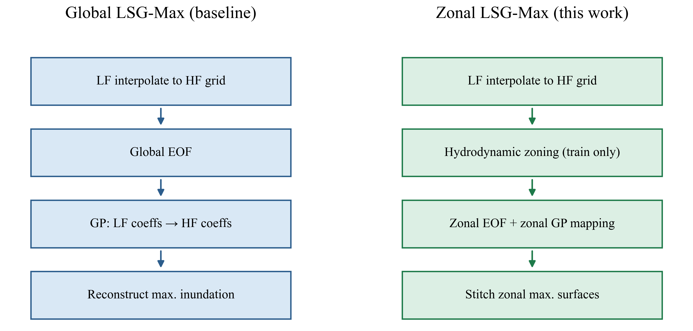

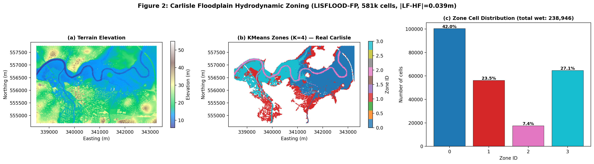

### 2.3 Fair comparison protocol and leakage controls

The matched retained-mode-budget protocol (Carlisle) compares equal total retained-mode budgets at B ∈ {4, 6}. Global B = 8 is retained only as a budget-audit exception (requested 8, realized 7), not as a strict equal-B claim. Matched budgets mean equal retained EOF capacity, not equal wall-clock cost or equal GP complexity. Area-weighted RMSE, MAE, bias, and CSI use geometric cell areas from Fraehr geometry:

RMSE_area = sqrt( Σ_i A_i (h_pred,i − h_ref,i)^2 / Σ_i A_i ),

with CSI_area formed from area-weighted hit, miss, and false-alarm counts at 0.03 m. Separating depth RMSE from extent CSI is intentional: LF may already score high CSI while still leaving structured depth residuals that zoning can reorganize under tight B. All fitted quantities are derived from training events only. Leakage controls include (i) verification that official Carlisle train and test indices are disjoint for both official folds, (ii) synthetic leave-one-out probes in which train-only zoning and EOF remain unchanged under extreme corruption of the held-out event while all-event zoning changes, and (iii) code-level checks that zoning feature construction is train-named. Default hyperparameters and seeds are provided in the Supplementary Information.

### 2.4 Residual organization, area-weighted oracle, and stage-swap

First-order EOI is the variance of zone-mean training |LF−HF| residuals divided by the variance of cellwise residuals on the training wet mask. High EOI indicates stronger between-zone organization of residual magnitude; it does not imply that zoning will improve LSG skill. We treat the EOI-as-switch test as an exploratory falsification of a plausible first-order training-data diagnostic, not as prospective selector validation. Second-order ZGG compares local-mode versus restricted-global-mode variance explanation at equal local rank. An equal-budget pure-EOF reconstruction oracle tests whether zoning improves HF reconstruction without GP learning. Oracle RMSE is reported both cell-unweighted and area-weighted; on Carlisle and Burnett the two coincide (uniform areas), while on Chowilla area weighting changes magnitudes but not the sign of ΔRMSE (still negative). Stage-swap arms (GG/ZZ/GZ/ZG) cross global versus zonal EOF coordinates with global versus zonal GP stacks; they are not four competing production models. GZ restricts and QR-orthonormalizes leading global modes within each zone before zonal GP mapping; ZG concatenates zonal expansion coefficients into a shared global-style GP stack. Both GZ and ZG are diagnostic approximations rather than algebraically exact stage substitutions; accordingly, the stage-swap is used to reject single-stage explanations, not to estimate a unique causal contribution of each stage.

### 2.5 Statistical claims and reproducibility

The principal Carlisle paired stability analysis is 9-fold event LOOCV at B = 4 (and secondary B = 6), with bootstrap confidence intervals on mean ΔRMSE = RMSE_global − RMSE_zonal (seed 42; 10,000 resamples). The LOOCV unit is an event: each fold holds out one event’s max surface, fits zoning, EOF, and GP on the remainder, and evaluates area-weighted metrics on the held-out surface. Official two-fold bootstrap is reported as a benchmark-compatible sensitivity check and is not promoted as the primary claim. Burnett uses 30-fold event LOOCV at B = 4. Representative held-out spatial maps are qualitative and must not be read as pooled skill. Code and evaluation artefacts are public at https://github.com/Coucou2016/202606-JOH-zonal-LSG (raw hydrodynamic archives excluded).

---

## 3. Results

Results follow a spatial-then-quantitative presentation: qualitative inundation maps first, then tables and curves.

### 3.1 Qualitative spatial results

**Carlisle primary map event.** Event index 1 (Run2) is the LOOCV fold with the largest Global RMSE spike at B = 4. Held-out LOOCV area-weighted RMSE on this fold is LF 0.233 m, Global 0.694 m, and Rule 0.166 m. Side-by-side maximum-depth maps (common colour scale) show that Global LSG-Max introduces floodplain artefacts relative to HF, whereas Rule recovers a visually closer depth field (Fig. A1).

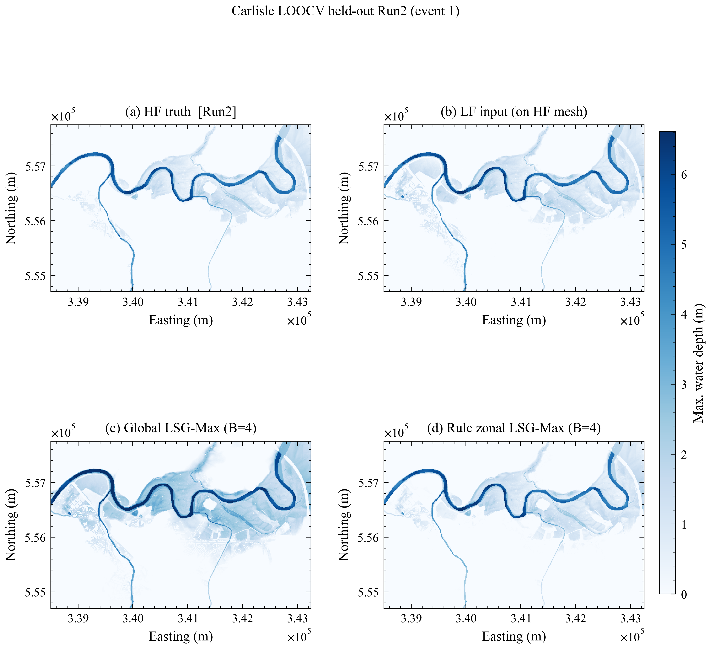

Wet/dry hit–miss maps (threshold 0.03 m) locate the CSI gap: Global CSI = 0.591 versus Rule CSI = 0.816 on the same held-out Run2 surface, with false-alarm cells markedly reduced under Rule (Fig. A2).

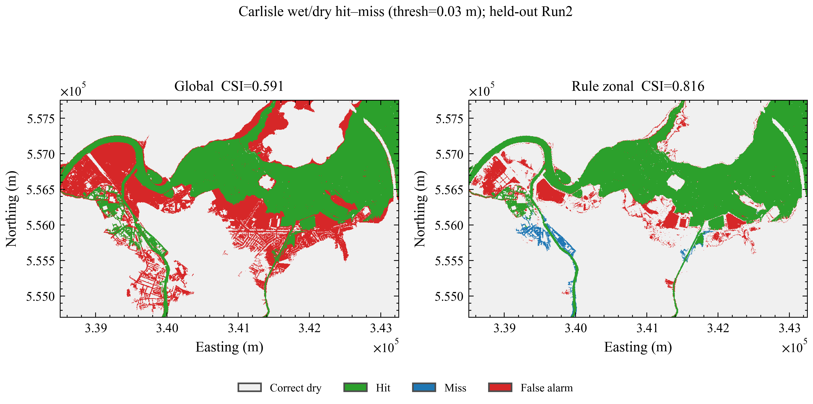

Residual panels (Global−HF, Rule−HF, and absolute-error improvement) show a broad over-deep Global bias that Rule largely removes across the wet floodplain (Fig. A3).

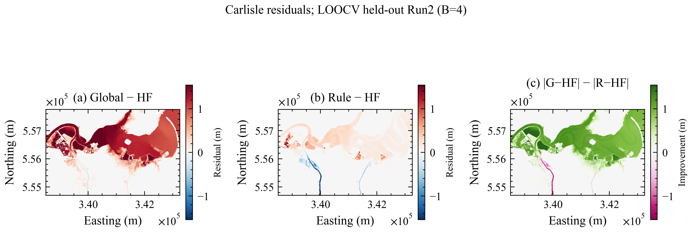

Rule zones from the train-only fit are overlaid on the HF depth field to link the partition to the inundation pattern (Fig. A4). Wet-cell observed-versus-predicted scatter complements the maps with a cell-level 1:1 view (Fig. A5).

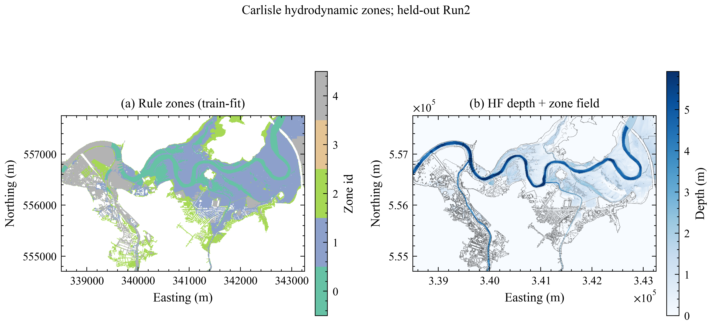

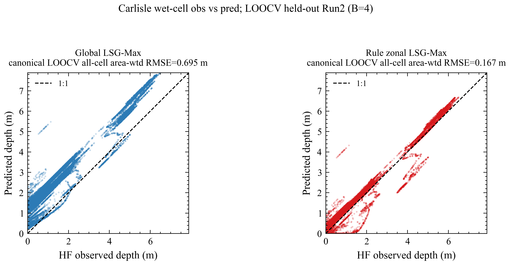

A milder Carlisle fold (event 0 / Run1; RMSE LF/Global/Rule ≈ 0.074 / 0.072 / 0.057 m) yields the same map types with smaller residuals. Boundary contrasts use the same LOOCV map suite: Burnett event 0 shows Global ≈ Rule spatially; Chowilla event 0 (Chow_p01) shows LSG fields far from HF while LF remains closer.

### 3.2 Equal-budget Carlisle curves

At B = 4, Global / Rule / KMeans area-weighted RMSE = 0.1464 / 0.0964 / 0.1015 m (Rule −34.2% versus Global). Across the audited budget sweep, Global RMSE increased from 0.1464 to 0.2588 and 0.3527 m, while Rule increased from 0.0964 to 0.1256 and 0.1790 m. B = 4 and 6 are strict matched-budget comparisons; the nominal Global B = 8 point realized seven modes and is retained only as a budget-audit exception. Fig. 3 therefore supports a capacity-sensitive Global curve under the audited protocol rather than a claim that more modes always help. Component-level attribution (for example, event-noise fitting) is not uniquely identified here. CSI does not show a matching zonal win: LF-only CSI (0.9145) exceeds LSG CSI at B = 4, so zoning improves depth RMSE more than wet–dry extent. This pattern is consistent with the maps in Section 3.1, where LF already captures most wet cells and Global artefacts are primarily depth errors (Figs. 3, 9, and 13).

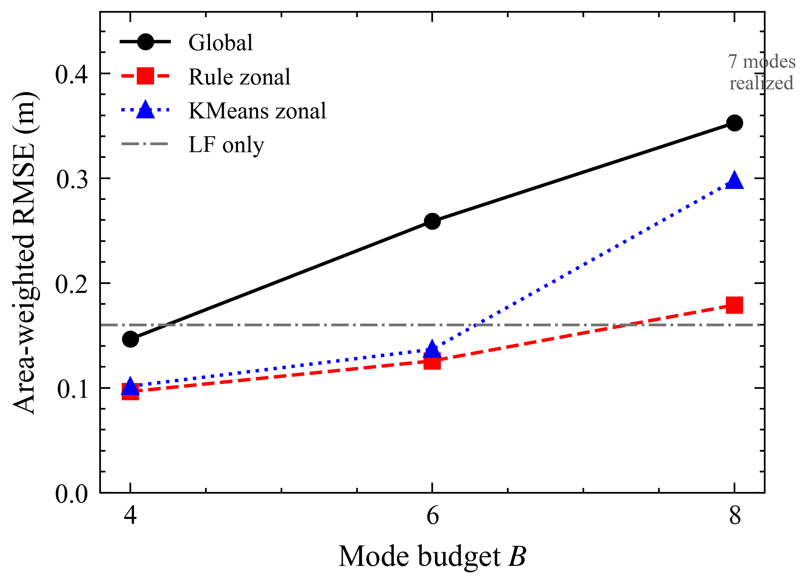

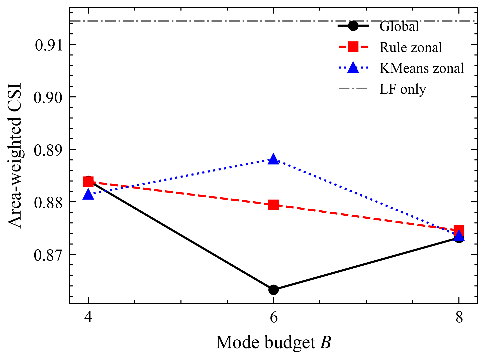

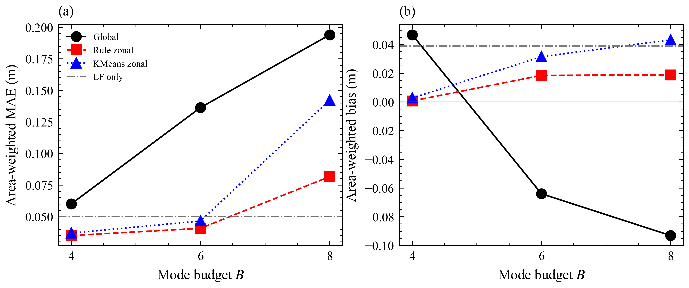

### 3.3 Event-level statistics

Carlisle B = 4 LOOCV: 9/9 folds improved; mean ΔRMSE = 0.0821 m; 95% CI [0.0155, 0.1987]. B = 6: 7/9; mean 0.0606 m; CI [0.0032, 0.1618]. Official two-fold: mean ΔRMSE = 0.0045 m; CI [−0.0073, 0.0134]; significant = false. These protocols answer different questions: LOOCV tests fold-consistent paired improvement under equal B, whereas the official two-fold split is a coarser, benchmark-compatible sensitivity check with wide uncertainty and must not be read as contradicting 9/9 LOOCV. Burnett B = 4 30-fold: mean Global 1.7479 m versus Rule 1.8260 m; ΔRMSE = −0.0781 m; 6/30; significant = false. The Burnett 12-event fixed split in Table 2 is a different protocol (Global ≈ Rule) and is not interchangeable with the 30-fold LOOCV non-benefit contrast (Figs. 8, 10, 11, and 12).

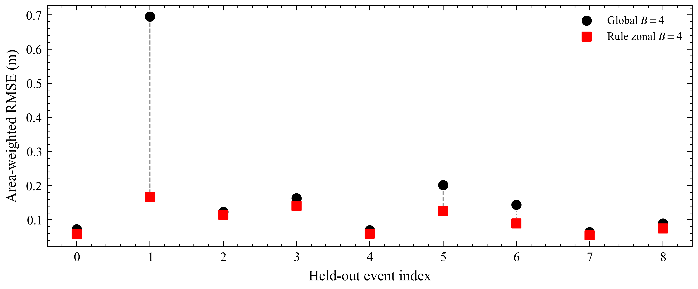

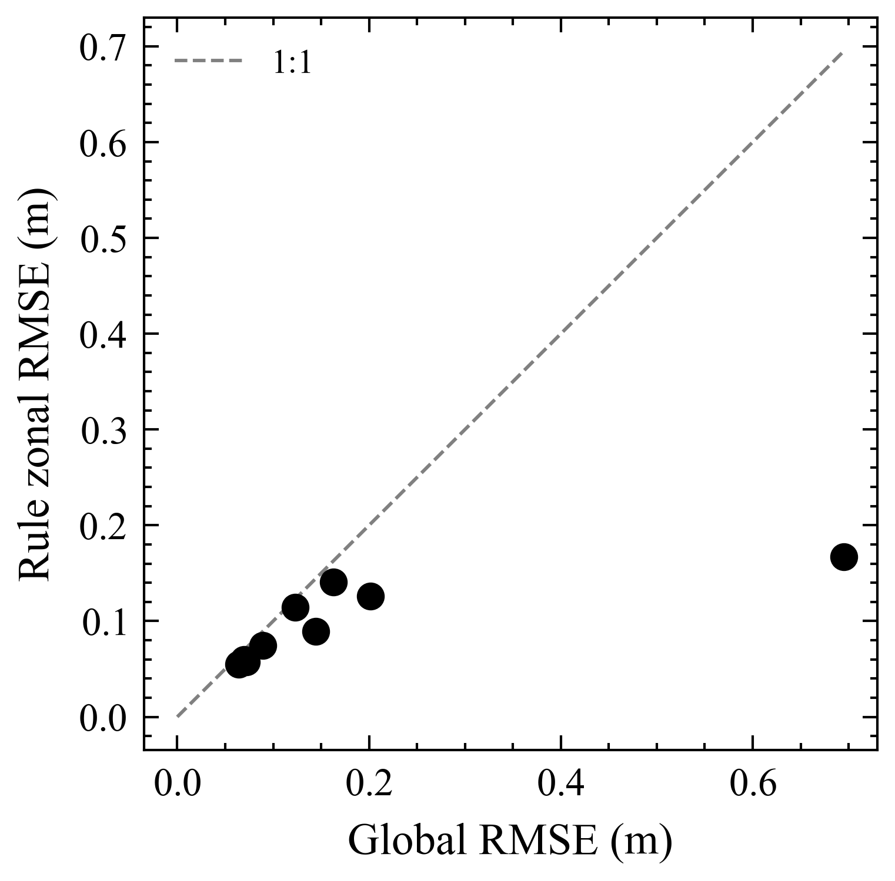

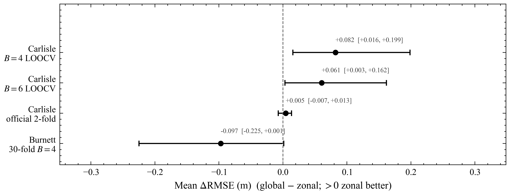

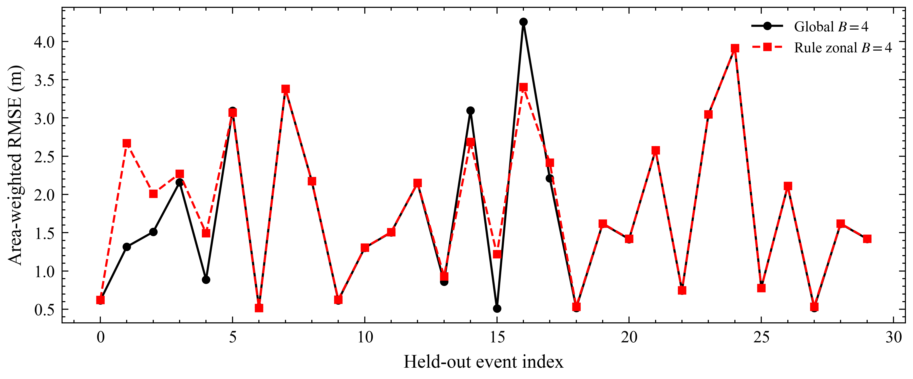

### 3.4 Three-case pattern

**Table 2.** Three-case area-weighted depth RMSE (m) at B = 4.

| Case | LF-only | Global B=4 | Rule B=4 | Pattern |
|---|---:|---:|---:|---|
| Carlisle | 0.1602 | 0.1464 | 0.0964 | Rule < Global < LF (RMSE; lower better) |
| Chowilla | 0.3926 | 2.5606 | 2.5614 | LF best; LSG RMSE worse than LF-only (upstream boundary) |
| Burnett (12-event fixed split) | 2.2323 | 1.6120 | 1.6122 | Global ≈ Rule (not the 30-fold LOOCV protocol) |

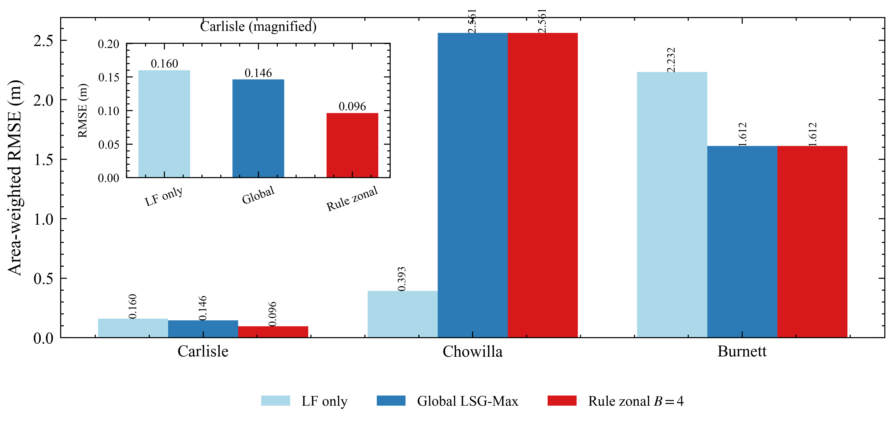

### 3.5 EOI, second-order, and stage-swap

Max-surface EOI: Carlisle 0.057, Chowilla 0.116, Burnett 0.957. Zoning benefit does not increase with EOI: the clearest equal-B gain occurs at the lowest EOI, while the highest EOI coincides with no Rule advantage. That pattern falsifies EOI-as-switch on the tested cases rather than estimating an operational threshold. Modal diagnostics show ZGG > 0 with equal-budget pure-EOF oracle ΔRMSE < 0 on all three cases, ruling out the claim that zoning helps merely by truncating HF EOF better. Area-weighted oracle ΔRMSE remains negative on Chowilla (−0.0543 versus −0.0657 unweighted) and is identical to the unweighted value on Carlisle and Burnett (uniform areas), so weighting does not rescue a truncation-only story. Stage-swap LOOCV means: GG ≈ 0.180, ZZ ≈ 0.098, GZ ≈ 0.098, ZG ≈ 0.101 m. Because GZ ≈ ZG ≈ ZZ ≪ GG, either approximate localization of the EOF coordinates or of the GP stack recovers most of the ZZ gain; the design therefore rejects single-stage necessity claims without uniquely identifying one localized stage as the mechanism (Figs. 14, 15, and 19).

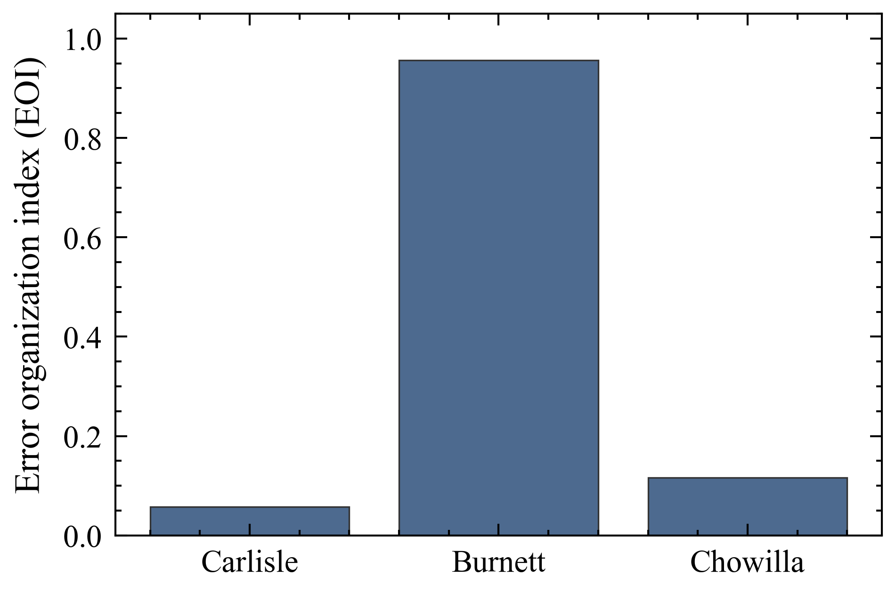

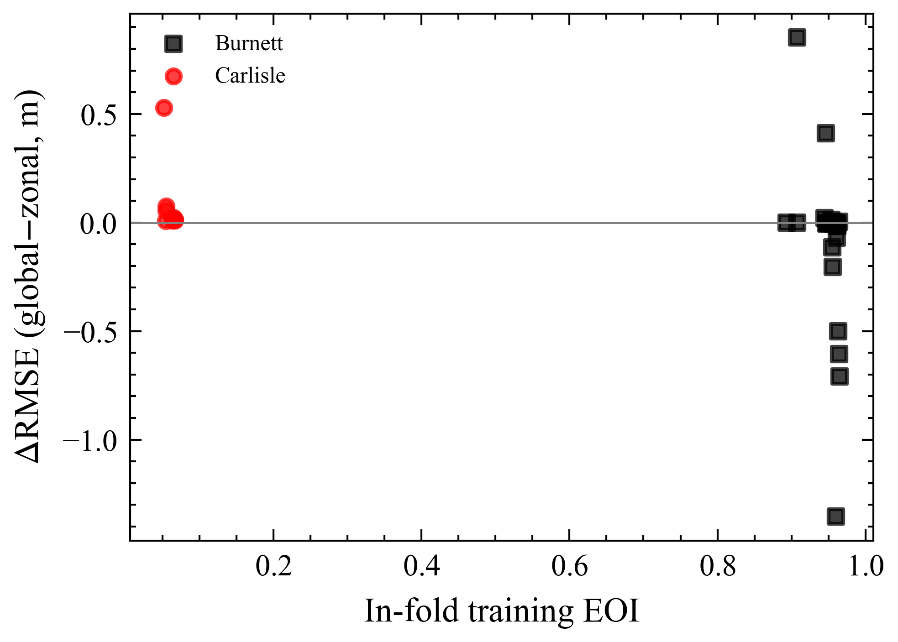

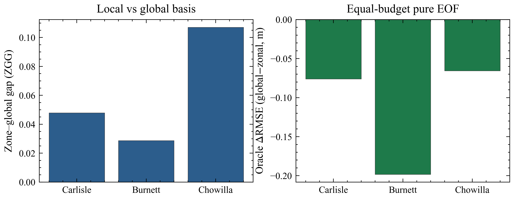

### 3.6 Published MaxWD contrast and robustness probes

This comparison is used only as a protocol-level sanity check and is not a head-to-head comparison with a locally reproduced LSG-TS implementation. On the official nine-fold MaxWD R² protocol, rule LSG-Max reaches 0.988 versus published LSG-TS 0.990 (Global Max ≈ 0.915). LF coarsening and channel-distance zoning probes (Figs. 17–18) support robustness narratives but are secondary to the equal-B LOOCV claim.

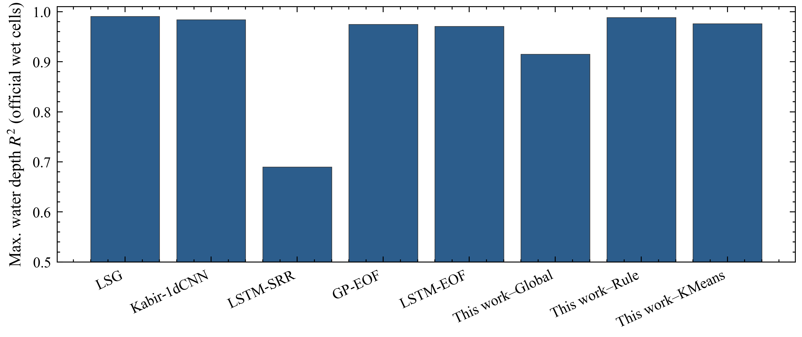

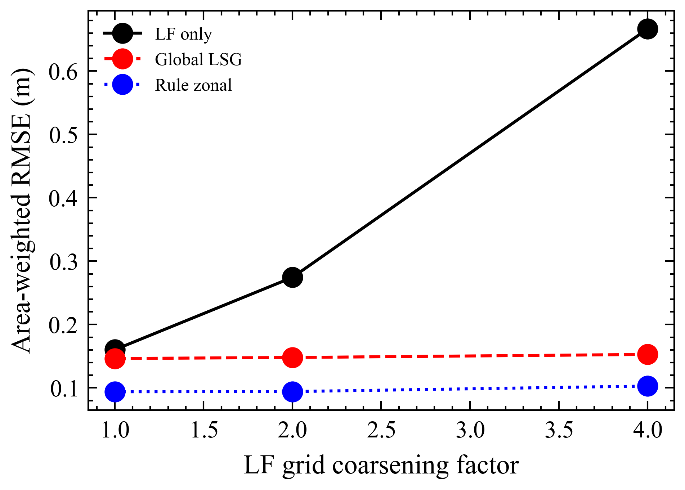

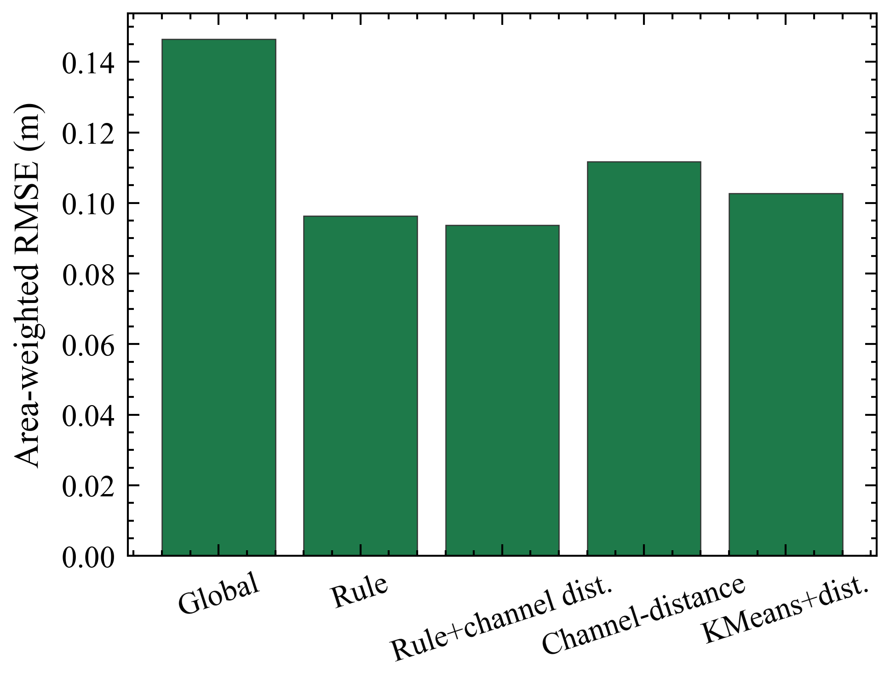

---

## 4. Discussion

The results distinguish three questions that should not be conflated. First, zoning can improve depth emulation at fixed retained-mode capacity, but the effect is case dependent; the Carlisle leave-one-out result is additionally bounded by the non-significant official two-fold sensitivity analysis. Second, the Carlisle diagnostics argue against a pure truncation explanation: the pure-EOF oracle and approximate stage-swap are instead consistent with zonal structure acting through the coupled reduced-representation and LF-to-HF mapping pipeline, without identifying a unique causal stage. Third, the tested max-surface EOI does not provide a transferable zoning rule across these cases. Burnett therefore represents a zoning non-benefit case, whereas Chowilla marks a more fundamental applicability boundary in which LSG itself performs worse than the low-fidelity field.

### 4.1 When does zoning help under equal representation capacity?

At Carlisle under equal B = 4, rule zoning reduced area-weighted depth RMSE with fold-consistent improvement (9/9 LOOCV). The gain concerns depth-error organization under limited capacity, not inventing wet cells that the LF already captures well (CSI remains LF-led). Qualitative maps of the worst Global fold reinforce the same point: Global artefacts are concentrated as depth bias and false structure on an already largely wet mask. In practical terms, Carlisle is the positive existence proof that a global EOF domain is not performance-neutral once retained-mode capacity is constrained and audited. The official two-fold contrast was non-significant and is kept as a sensitivity check; non-significance there does not negate LOOCV fold consistency because the splits, sample sizes, and inferential targets differ. Burnett 30-fold leave-one-out remains the equal-budget non-benefit contrast, and the 12-event fixed split only shows Global ≈ Rule under another protocol. “Conditional” therefore means that zoning can help under matched capacity on at least one public case, but the same protocol does not transfer automatically to Burnett or Chowilla. Claiming a universal zoning win from Carlisle alone would over-reach the evidence.

### 4.2 Why can zoning help when it does?

The diagnostics progressively narrow, but do not uniquely identify, the mechanism. First-order EOI does not explain the cross-case pattern: if residual heterogeneity were a sufficient switch, Burnett should be the easiest zoning win and Carlisle the hardest, yet the opposite occurs. The pure-EOF oracle (cell- and area-weighted) argues against a truncation-only account, because equal-B zonal EOF reconstruction of HF is worse, not better, before any GP is trained. The approximate Carlisle stage-swap is instead consistent with zonal structure entering the coupled reduced-representation and LF-to-HF mapping problem, while providing no basis for assigning the gain uniquely to EOF localization or GP localization. Relative to Tan et al. (2025) regionalized LSG training and Wang et al. (2025) REOF–sparse-GP localization, the present contribution is not that localization exists, but that equal-B zoning plus stage-resolved falsification can reject simple selectors and simple single-stage stories. The non-monotonic Global–B behaviour is reported as a related capacity observation, not as the Discussion spine: it warns against reading “more modes” as an automatic remedy for Global underperformance under the audited protocol.

### 4.3 When should zoning not be used?

The present results do not support zoning from residual heterogeneity alone. Across the three tested cases, max-surface EOI provides no reliable threshold for choosing between global and zonal LSG: Burnett combines the highest EOI with no Rule advantage, whereas Carlisle shows the clearest benefit at the lowest EOI. These are distinct failure modes and should not be conflated. Burnett is a zoning non-benefit under equal B despite strong residual organization. Chowilla is an upstream LSG-versus-LF applicability boundary: LSG RMSE exceeds LF-only, so the first decision is whether statistical LF-to-HF correction is appropriate at all; partitioning the reduced representation is secondary. EOI has been ruled out as a sufficient first-order training-data diagnostic, but the present experiments do not establish a transferable operational selector. Until a pre-registered selector is validated on an unseen case, the operational recommendation is diagnostic, not automatic: run equal-B Global versus Rule (or KMeans) comparisons, inspect LF-only baselines, and treat zoning as optional rather than default.

Rival explanations rejected or weakened include: (i) accidental unequal budgets (audited); (ii) test leakage into zoning (train-only fits and leakage audits); (iii) GP-only localization as the unique cause (ZG ≈ ZZ as well as GZ ≈ ZZ); and (iv) official two-fold as primary evidence (CI includes zero).

### 4.4 Limitations and scope boundaries

Limitations are grouped by transfer type rather than listed as open tasks.

**Implementation transfer.** Production numbers use LSG-Max with scikit-learn GP regression. A sparse GPflow path is implemented but not executed here. Closing this boundary requires re-running Carlisle B = 4 Global/Rule LOOCV under SGPR with the Supplementary Information defaults and reporting whether Rule still beats Global on 9/9 folds within the same area-weighted RMSE protocol. Real-data zonal LSG-TS is likewise out of scope for headline claims.

**Domain transfer.** Carlisle is the only clear zoning-positive public case in this study. Brisbane licensed data are unavailable. Burnett KMeans LOOCV and the full 74-event evaluation remain incomplete; until those artefacts exist, Burnett claims are restricted to the 30-fold Rule LOOCV and the 12-event fixed-split table. Chowilla archive checksum and datum provenance remain unresolved and are disclosed as a data-integrity caveat, not a numeric rewrite.

**Decision transfer.** No transferable operational zoning selector is claimed. Prospective selector validation would require a pre-registered diagnostic, a hold-out case protocol, and success/failure criteria defined before looking at test metrics; that experiment is not claimed here. Historical temporal EOI uses a different protocol and is Supplementary Information only.

**Structural reference precision.** Fraehr et al. (2024) *Water Research* is the intended multi-case presentation template, but automated full-text retrieval was blocked by publisher access controls; length and structure targets therefore follow Fraehr (2022) and Tan (2025) full texts plus Fraehr (2024) abstract and metadata only. Exact full-text length matching to Fraehr (2024) is not claimed.

---

## 5. Conclusions

1. Under matched retained-mode capacity, Carlisle shows that a global EOF representation can be performance-sensitive: Rule zoning reduces area-weighted RMSE from 0.1464 to 0.0964 m at B = 4 and improves all nine leave-one-out folds.
2. In the Carlisle budget sweep, increasing the requested global mode count did not recover the B = 4 zonal advantage; the nominal B = 8 point is retained as an audited mismatch (Global realized 7 modes) rather than a strict equal-B comparison.
3. Zoning benefit is conditional: Burnett 30-fold LOOCV does not favour Rule; Chowilla is an upstream LSG-versus-LF applicability boundary where LSG RMSE exceeds LF-only.
4. Across these cases, first-order max-surface EOI does not select zoning; mechanism evidence rules out pure-EOF truncation and does not uniquely pin the gain to one stage (Carlisle stage-swap).
5. Official two-fold non-significance must be stated; it is a sensitivity check, not the principal paired claim.

---

## Data and code availability

The hydrodynamic cases are from the public Fraehr multi-fidelity inundation benchmark (Figshare 24312658). Analysis code, evaluation artefacts, and figure sources are available at https://github.com/Coucou2016/202606-JOH-zonal-LSG. Raw hydrodynamic archives are excluded from the public repository. Hyperparameter defaults and seeds are listed in the Supplementary Information.

---

## References (independently verified seed list)

1. Fraehr, N., Wang, Q. J., Wu, W., & Nathan, R. (2022). Upskilling low-fidelity hydrodynamic models of flood inundation through spatial analysis and Gaussian Process learning. *Water Resources Research*, 58, e2022WR032248. https://doi.org/10.1029/2022WR032248
2. Fraehr, N., Wang, Q. J., Wu, W., & Nathan, R. (2023). Development of a fast and accurate hybrid model for floodplain inundation simulations. *Water Resources Research*, 59, e2022WR033836. https://doi.org/10.1029/2022WR033836
3. Fraehr, N., et al. (2024). Assessment of surrogate models for flood inundation: The physics-guided LSG model vs. state-of-the-art machine learning models. *Water Research*, 252, 121202. https://doi.org/10.1016/j.watres.2024.121202
4. Bentivoglio, R., Isufi, E., Jonkman, S. N., & Taormina, R. (2022). Deep learning methods for flood mapping: a review of existing applications and future research directions. *Hydrology and Earth System Sciences*, 26, 4345–4378. https://doi.org/10.5194/hess-26-4345-2022
5. Teng, J., Jakeman, A. J., Vaze, J., Croke, B. F. W., Dutta, D., & Kim, S. (2017). Flood inundation modelling: A review of methods, recent advances and uncertainty analysis. *Environmental Modelling & Software*, 90, 201–216. https://doi.org/10.1016/j.envsoft.2017.01.006
6. Bates, P. D. (2022). Flood inundation prediction. *Annual Review of Fluid Mechanics*, 54, 287–315. https://doi.org/10.1146/annurev-fluid-030121-113138
7. Lu, J., Wang, Q. J., Fraehr, N., Xiang, X., & Wu, X. (2025). Choice of Gaussian Process kernels used in LSG models for flood inundation predictions. *Journal of Hydrology*, 655, 132949. https://doi.org/10.1016/j.jhydrol.2025.132949
8. Carreau, J., & Guinot, V. (2021). A PCA spatial pattern based artificial neural network downscaling model for urban flood hazard assessment. *Advances in Water Resources*, 147, 103821. https://doi.org/10.1016/j.advwatres.2020.103821
9. Zhou, Y., Wu, W., Nathan, R., & Wang, Q. J. (2021). A rapid flood inundation modelling framework using deep learning with spatial reduction and reconstruction. *Environmental Modelling & Software*, 143, 105112. https://doi.org/10.1016/j.envsoft.2021.105112
10. Zhou, Y., Wu, W., Nathan, R., & Wang, Q. J. (2022). Deep learning-based rapid flood inundation modeling for flat floodplains with complex flow paths. *Water Resources Research*, 58, e2022WR033214. https://doi.org/10.1029/2022WR033214
11. Tan, Z., Xu, D., Taraphdar, S., Ma, J., Bisht, G., & Leung, L. R. (2025). An efficient hybrid downscaling framework to estimate high-resolution river hydrodynamics. *Hydrology and Earth System Sciences*, 29, 3833–3852. https://doi.org/10.5194/hess-29-3833-2025
12. Wang, R., Lian, J., Yuan, X., Tian, F., Li, K., & Liu, Z. (2025). Rapid simulation of floods by considering the spatial and temporal characteristics of inundation. *International Journal of Disaster Risk Science*, 16, 481–495. https://doi.org/10.1007/s13753-025-00642-5
13. Fraehr, N., Wang, Q. J., Wu, W., & Nathan, R. (2023). Supercharging hydrodynamic inundation models for instant flood insight. *Nature Water*, 1, 835–843. https://doi.org/10.1038/s44221-023-00132-2
14. Wang, W., Wang, Q. J., & Nathan, R. (2026). Strategies for predicting flood inundation in a large and complex floodplain based on low-fidelity hydrodynamic models. *Water Resources Research*. https://doi.org/10.1029/2025WR042481

---

## Scope boundaries (editorial)

- GP backend remains scikit-learn until sparse GPflow is executed under the acceptance criterion in Limitations.
- Brisbane licensed hydrodynamic archives are absent; no Brisbane skill claim is made.
- Headline results are LSG-Max; real zonal LSG-TS is not asserted.
- No transferable zoning selector is claimed after EOI falsification.
- Author list, funding, and exact target-journal administrative wording remain editorial.
