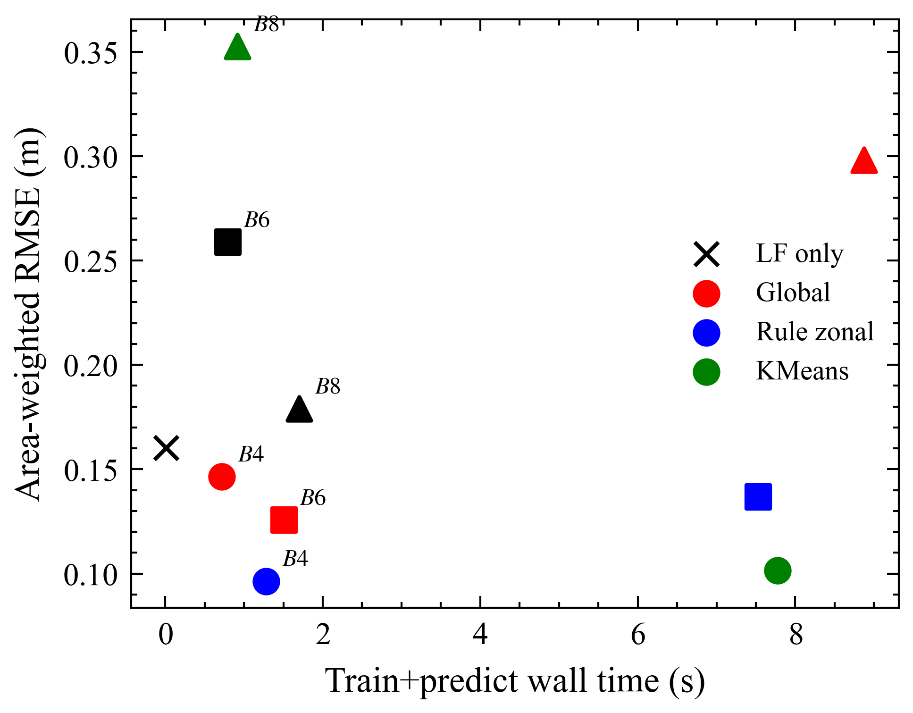

# 全局 EOF 降维何时不足以支撑多保真洪水淹没模拟？

**副标题：** 水动力分区 LSG-Max：等模态预算、面积加权指标与训练期分区

**文档类型：** 完整深度扩写版内部研究报告 / 与 JOH 投稿平行（不覆盖 `研究报告.*` 与英文 `report.*`）

**项目路径：** `I:\Projects\202606-JOH-zonal-LSG`

**日期：** 2026-08-16

**生成脚本：** `scripts/99_full_report_zh.py`（图解库 `scripts/_deep_fig_zh.py`）

图的二进制请在 `完整研究报告.html` 中查看（已 Base64 内嵌），或打开 `outputs/figures/` 下的 PNG。下文保留全部数字与深度解说。

---

## 目录

1. [摘要](#1-摘要)
2. [研究背景与目的](#2-研究背景与目的)
3. [数据与方法](#3-数据与方法)
4. [研究过程](#4-研究过程)
5. [结果展示](#5-结果展示)
6. [分析与讨论](#6-分析与讨论)
7. [主要结论](#7-主要结论)
8. [不足与展望](#8-不足与展望)
9. [附录](#9-附录)

---

## 1 摘要

本文问的是一个很具体的方法学问题：在多保真洪水淹没代理模型里，把整个泛滥平原当作一块“均匀布”去做经验正交函数（Empirical Orthogonal Function，EOF）降维，是否在水动力学上保持中性？若残差在空间上是分块组织的，全局降维就可能把河道、常淹滩地与边缘浅水搅在同一组模态里，从而在模态预算紧张时学偏。

针对这一问题，本文在 Fraehr 等人（2024）公开基准上实现**水动力分区的 LSG-Max**（Low-fidelity–Spatial analysis–Gaussian Process，仅最大淹没面）。分区在 EOF 和高斯过程（Gaussian Process，GP）之前完成。评价使用**真等模态预算 B**、**面积加权指标**以及**仅用训练事件做分区**。

> **Carlisle 主结果。** 审计等预算协议下 B = 4 时，规则分区把面积加权 RMSE 从 0.1464 m 降到 0.0964 m（34.2%）。9 折事件 LOOCV 中 9/9 折分区更优，ΔRMSE 均值 0.0821 m，95% 区间 [0.0155, 0.1987] m。时序 EOI = 0.51；最大面 EOI = 0.057。全局随请求 B 增大而变差（0.1464 → 0.2588 → 0.3527 m；名义 B=8 实际全局模态 7），规则更稳健（0.0964 → 0.1256 → 0.1790 m）。

> **官方 2 折并不显著。** 平均 ΔRMSE = 0.0045 m，95% 区间 [-0.0073, 0.0134]，`significant=false`。9 折 LOOCV 才是统计主声称。

> **Burnett 30 折：分区没有帮忙。** 全局均值 1.7479 m，规则 1.8260 m，ΔRMSE = -0.0781 m，6/30 折，区间 [-0.2116, 0.0405]，`significant=false`。最大面 EOI 却高达 0.957。

> **机制。** 纯 EOF oracle ΔRMSE&lt;0；stage-swap LOOCV 均值 GG/ZZ/GZ/ZG ≈ 0.180/0.098/0.098/0.101 → GZ≈ZG≈ZZ≪GG。收益来自分区结构进入表示→映射管线。

Chowilla 为边界情形：LSG RMSE 约 2.5606 m，仅用 LF 为 0.3926 m。GP 后端为 sklearn GPR，非 gpflow SGPR【待补充】。Novelty=等预算条件性分区+EOI 证伪+stage-swap+诚实边界；勿写“首次 zonal LSG”。

## 2 研究背景与目的

### 2.1 科学问题

细网格二维水动力模型可信但昂贵。多保真思路用低保真给出轮廓，再用少量高保真样本学习系统偏差。Fraehr 等人的 LSG 对高保真场做 EOF，将低保真投影到同一空间基，再用 GP 学习系数映射。全局 EOF 默认整张泛滥平原共享模态——这一默认是否水动力中性，是本文的方法学问题。

**核心问题：** 当模态预算 B 被公平限制、指标按面积加权、分区只用训练事件时，全局 EOF 在什么条件下已经不够，而水动力分区能够稳定降低水深 RMSE？

修订叙事：Carlisle 是“分区有用但最大面一阶 EOI 并不高”的正例；Burnett 是“最大面一阶 EOI 极高但分区无益”的反例；Chowilla 是“LSG 帮倒忙”的边界。

### 2.2–2.4 术语

完整术语与符号溯源见 HTML 第 2.3–2.4 节（EOF/GP/LSG/EOI/ZGG/stage-swap/面积加权公式等）。Markdown 从略，以免与 HTML 双份维护漂移；以 HTML 为准。

## 3 数据与方法

### 3.1 三个案例

网格单元数来自 Fraehr 几何：581,061 / 5,681（Carlisle），109,914 / 1,434（Chowilla），780,785 / 15,256（Burnett）。

**表 1　案例摘要**

| 属性 | Carlisle（卡莱尔） | Chowilla（乔维拉） | Burnett River（伯内特河） |
|---|---|---|---|
| 国家 | 英国 | 澳大利亚 | 澳大利亚 |
| 高保真（HF）模型 | LISFLOOD-FP | MIKE 21 | TUFLOW |
| 低保真（LF）模型 | HEC-RAS 2D | MIKE 21（粗网格） | HEC-RAS 2D |
| HF 网格单元数 | 581,061 | 109,914 | 780,785 |
| LF 网格单元数 | 5,681 | 1,434 | 15,256 |
| 本文使用 / 库中可用事件数 | 9 / 9 | 12 / 31 | 12（单次划分）或 30（LOOCV） / 74 |
| 在本文中的角色 | 主证据：9 折事件 LOOCV | 边界情形：LSG 劣于仅用 LF | 对照：分区未优于全局 |
| 仅用 LF 的面积加权 RMSE（m） | 0.1602 | 0.3926 | 2.2323 |
| 残差组织指数 EOI（最大淹没面，本次） | 0.057（低） | 0.116（低） | 0.957（高） |
| 时序残差 EOI（历史，7 场训练） | 0.51（高） | — | — |

最大面 EOI：Carlisle 0.057，Chowilla 0.116，Burnett 0.957。时序 EOI（Carlisle）为 0.51。

**表 2　实验矩阵**

| 编号 | 模型 | 分区方式 | EOF 模态预算 | 目的 |
|---|---|---|---|---|
| E0 | 仅用 LF | 不适用 | 不适用 | 低保真基线 |
| E1 | 全局 LSG-Max | 全区（1 区） | 强制 B = 4 / 6 / 8 | 等预算对照 |
| E2 | 规则分区 zLSG-Max | 水深 + 淹没频率规则 | B = 4 / 6 / 8 | 物理分区 |
| E3 | KMeans 分区 zLSG-Max | KMeans（K = 4） | B = 4 / 6 / 8 | 数据驱动分区 |
| E4 | Carlisle 9 折 LOOCV | 规则 vs 全局 | B = 4 与 B = 6 | 事件级显著性 |
| E5 | 官方 2 折自助法 | 规则 vs 全局 | Fraehr 官方划分 | 诚实报告：不显著 |
| E6 | Chowilla 边界 | 全局 / 规则 / KMeans | B = 4 / 8 / 12 | LSG 退化 |
| E7 | BurnettRV 检验 | 全局 / 规则 / KMeans | B = 4 / 8 | 高一阶 EOI 但分区无益对照 |

### 3.2–3.5 方法要点

湿润阈值 0.03 m；规则/KMeans 分区、EOF、GP 均只在训练事件上拟合；审计等预算（B=4/6 严格匹配；名义 B=8 全局实际 7 模态为例外）；面积加权；Carlisle Fold 1 泄漏审计 CLEAN_PASS（全折/多案例自动审计【待补充】）；二阶 ZGG + 纯 EOF oracle；stage-swap GG/ZZ/GZ/ZG。

### 图 1　全局 LSG 与分区 LSG 的流程对照（示意图）

> **示意/合成管线配图，不可当作论文数字。** 二进制图见 HTML 或 `outputs/figures/fig01_workflow.png`。

左列全局 EOF+GP；右列先分区再分区 EOF+GP。示意图不含可引用 RMSE。逐子图深度解释见 HTML。

### 图 2　Carlisle 真实地形与 KMeans 四区

(a) 地形；(b) K=4 湿区；(c) 湿单元计数。真实几何。深度读图见 HTML。

## 4 研究过程

轨道 A（合成）不可引用；轨道 B 可引用。本完整版不覆盖 `研究报告.*` 与英文 `report.*`。

**表 8　泄漏审计**

| 检查项 | 状态 | 要点 |
|---|---|---|
| 划分来源 | OK | 官方 npz；训练 1893 步、检验 211 步、重叠 0 |
| 分区特征 | OK | 最大水深、淹没频率、残差、KMeans 标准化器均仅用训练事件 |
| EOF 与 GP | OK | EOF 基、HF 均值、GP 仅在训练 LF/HF 系数上拟合 |
| 指标 | OK | 全部在检验集计算；面积权来自几何，不依赖标签 |
| 总体 | CLEAN_PASS | passed=true；随机种子 42 |

**表 7　模态预算审计**

| 案例 | 模型 | 请求的 B | 实际模态数 | 区数 | 状态 |
|---|---|---|---|---|---|
| Carlisle | Global | 4 | 4 | N/A | OK |
| Carlisle | KMeans | 4 | 4 | 4 | OK |
| Carlisle | Rule | 4 | 4 | 4 | OK |
| Carlisle | Global | 6 | 6 | N/A | OK |
| Carlisle | KMeans | 6 | 6 | 4 | OK |
| Carlisle | Rule | 6 | 6 | 4 | OK |
| Carlisle | Global | 8 | 7 | N/A | MISMATCH |
| Carlisle | KMeans | 8 | 8 | 4 | OK |
| Carlisle | Rule | 8 | 8 | 4 | OK |

## 5 结果展示

### 5.1 Carlisle 模态预算对照与审计

**表 3　面积加权 RMSE**

| B | 全局 RMSE（m） | 规则分区 RMSE（m） | KMeans RMSE（m） | 规则相对全局降幅 | 全局实际模态数 |
|---|---|---|---|---|---|
| 4 | 0.1464 | 0.0964 | 0.1015 | +34.2% | 4 |
| 6 | 0.2588 | 0.1256 | 0.1367 | +51.5% | 6 |
| 8 | 0.3527 | 0.1790 | 0.2980 | +49.3% | 7 |
| 仅用 LF | 0.1602 | — | — | — | 0 |

全局 B=4→B=8 升高 141%，规则升高 86%。B=4 规则相对全局 34.2%。

**表 3b　CSI** / **表 3c　MAE与偏差** / **表 R　残差组织** 见 HTML 对应表。

### 图 3　Carlisle 真等预算 RMSE–B 曲线

全局随 B 上升最快；规则始终最低。逐曲线深度解释见 HTML。

### 图 4　CSI 随 B 变化

LSG 的 CSI 低于仅用 LF；分区赢在 RMSE 而非湿干范围。

### 图 5　MAE 与偏差

全局 B 增大后偏差变负；规则偏差靠近 0。

### 5.2 LOOCV 与官方 2 折

**表 4　事件级检验**

| 检验 | 改善折数 | 平均 ΔRMSE（m） | 95% 自助法区间 | 区间是否不含 0 |
|---|---|---|---|---|
| Carlisle B=4 事件 LOOCV | 9/9 | 0.0821 | [0.0155, 0.1987] | 该 fold-bootstrap 95% CI 不跨 0 |
| Carlisle B=6 事件 LOOCV | 7/9 | 0.0606 | [0.0032, 0.1618] | 该 fold-bootstrap 95% CI 不跨 0 |
| Carlisle 官方 2 折 | 75% 的检验事件 | 0.0045 | [-0.0073, 0.0134] | 否（significant=false） |
| Burnett B=4 的 30 折 LOOCV | 6/30 | -0.0781 | [-0.2116, 0.0405] | 否（significant=false） |

**表 6　B=4 逐事件**

| 留出事件 | 全局 RMSE（m） | 规则分区 RMSE（m） | ΔRMSE（全局−分区） | 分区是否更优 |
|---|---|---|---|---|
| 0 | 0.0724 | 0.0575 | 0.0149 | 是 |
| 1 | 0.6953 | 0.1668 | 0.5284 | 是 |
| 2 | 0.1231 | 0.1146 | 0.0085 | 是 |
| 3 | 0.1631 | 0.1406 | 0.0225 | 是 |
| 4 | 0.0698 | 0.0596 | 0.0102 | 是 |
| 5 | 0.2017 | 0.1259 | 0.0758 | 是 |
| 6 | 0.1442 | 0.0894 | 0.0548 | 是 |
| 7 | 0.0639 | 0.0550 | 0.0089 | 是 |
| 8 | 0.0895 | 0.0744 | 0.0151 | 是 |

### 图 6　Carlisle 九折 LOOCV（B=4）

规则线在全部 9 个留出事件上低于全局。

### 图 7　1:1 散点

九点均在 1:1 线下方；事件 1 远离原点。

### 图 8　四种协议的 ΔRMSE 森林图

仅 Carlisle 9 折 B=4/6 的须不跨 0。

### 5.3–5.4 三案例与 Burnett

**表 5**

| 案例 | 仅用 LF | 全局 B=4 | 规则分区 B=4 | 模式 |
|---|---|---|---|---|
| Carlisle | 0.1602 | 0.1464 | 0.0964（+34.2%） | 分区优于全局，二者均优于仅用 LF（就 RMSE 而言） |
| Chowilla | 0.3926 | 2.5606 | 2.5614 | 仅用 LF 最好；LSG 显著退化 |
| BurnettRV（12 事件单次划分） | 2.2323 | 1.6120 | 1.6122 | 全局 ≈ 分区，二者均改善 RMSE |

### 图 9　三案例 RMSE 柱状图

Carlisle 分区最好；Chowilla LSG 远高于 LF；Burnett 全局≈分区。

### 图 10　Burnett 30 折

两条线纠缠；分区不系统更优。

### 图 11　精度–耗时

规则 B=4 位于较优前沿。

### 5.5 stage-swap

LOOCV 均值：GG≈0.180、ZZ≈0.098、GZ≈0.098、ZG≈0.101 m → **GZ≈ZG≈ZZ≪GG**。机制叙述见 HTML 5.5 / 6.6。

## 6 分析与讨论

**为何 Carlisle 有效：** LF 已抓住主导地形；规则切区符合水深–频率结构；等预算下全局表示非中性；但最大面 EOI 仅 0.057——故不是“高 EOI 开关”。

**为何加模态变差：** 观察为全局 RMSE/偏差随请求 B 恶化；原因未唯一识别，不作过拟合定论。

**为何 Burnett/Chowilla 不然：** Burnett 高 EOI=0.957 但等预算分区无益（原因未唯一识别）；Chowilla 主要为 LSG-vs-LF 适用性边界（EOI=0.116）。

**EOI 证伪 + stage-swap：** 一阶 EOI 不能当开关；oracle 排除纯截断；stage-swap 显示表示或映射任一段分区化即可收回大部分收益。

### 图 14　三案例最大淹没面 EOI

Burnett 高、Carlisle/Chowilla 低；与分区是否获益方向相反。

### 图 15　EOI vs Δ

点云无正斜率。

### 图 19　二阶 ZGG/oracle

ZGG>0 但 oracle ΔRMSE<0。

### 图 16　官方 MaxWD R²

规则 LSG-Max 0.988 vs 已发表 LSG-TS 0.990。

### 图 17　LF 加粗

规则对 LF 变粗稳健。

### 图 18　主槽距离

物理切区可替代残差热点。

## 7 主要结论

1. Carlisle、B=4：全局 EOF 非中性；规则分区 RMSE 0.1464→0.0964 m（34.2%），9/9 LOOCV。
2. 加大全局 B 不如分区消化容量。
3. 收益依案例；最大面 EOI 不能预测增益。
4. 官方 2 折不显著，不得当作主声称。
5. 官方 9 折 MaxWD R²：规则 0.988 vs 已发表 LSG-TS 0.990。
6. stage-swap：GZ≈ZG≈ZZ≪GG；oracle 排除纯截断。
7. Novelty：等预算条件性分区 + EOI 证伪 + stage-swap + 诚实边界；勿写“首次 zonal LSG”。

## 8 不足与展望

sklearn GPR 而非 gpflow SGPR【待补充】；无真实 LSG-TS【待补充】；Chowilla MD5/基准【待补充】；Burnett KMeans LOOCV 与 74 场【待补充】；Brisbane 未运行【待补充】。

## 9 附录

Fraehr（2024）Figshare 24312658。数字来自 `outputs/registry/` 与 `outputs/evaluation/**`。复现：`D:\miniforge3\envs\hydromodel\python.exe scripts\99_full_report_zh.py`

**表 11 脚本索引** / **表 12 待补充** 见 HTML。PDF 工具链：Edge/Chrome `--print-to-pdf`（与 95/96 相同）。
